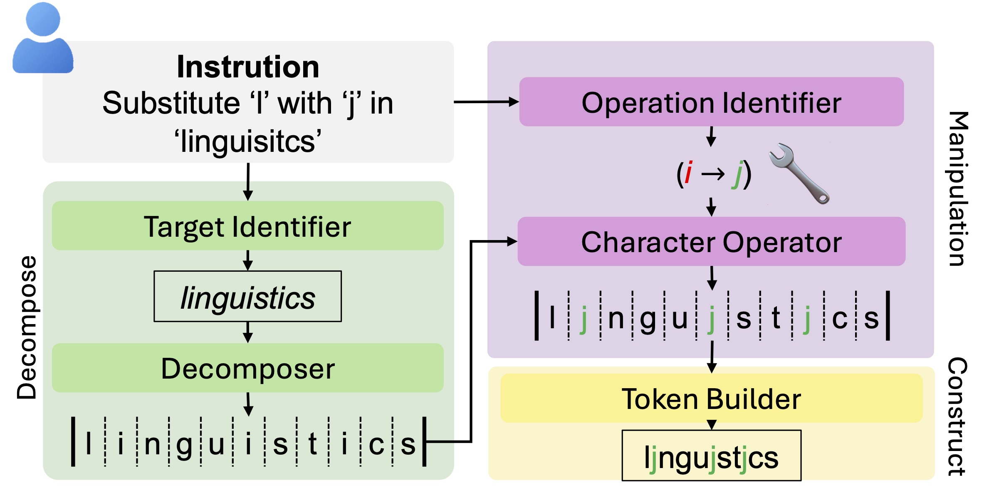

# Enhancing LLM Character-Level Manipulation via Divide and Conquer

<div align="center">


[](https://www.arxiv.org/abs/2502.08180)

</div>

<div align="center" style="display: inline-block;">
  
</div>

## 🔍 Overview

This repository contains the official implementation of **Enhancing LLM Character-Level Manipulation via Divide and Conquer**, a novel approach designed to enhance Large Language Models' (LLMs) capabilities in character-level string manipulation.

## 🌟 Key Features

- We present the first systematic analysis of
character manipulation challenges in LLMs
and identify a specific structural variation
form that boosts LLM’s reasoning ability on
character-level knowledge.
- We propose a novel zero-shot approach that
significantly improves character operation capabilities while being compatible with existing models without extra finetuning.
- We provide extensive experimental analysis that not only validates our method but also
offers insights for future research in enhancing
LLM character-level reasoning.

## 🚀 Getting Started

### Prerequisites

We recommend using conda to set up the environment:

```bash
conda env create -f environment.yml
conda activate chardc
```

###  Reproduce
Specify experiment configuration at the top of the `ToCAD.py` file.
```python
# experiment arguments
ARGS = {
    "model_path": "gpt-4o-mini-2024-07-18",
    "task": "ins_char",
    "max_new_tokens": 150,
    "output_dir": "result/CAD",
    "testing_dataset_range": (0, 1000),
    "resumable": True,
}
```
Execute experiment the following command:
```bash
python ToCAD.py
```

## 🔬 Cite Our Work

If you find our work useful, please consider citing our paper:

```bibtex
@article{zhen2025character,
  title={Enhancing LLM Character-Level Manipulation via Divide and Conquer},
  author={Zhen, Xiong and Yujun, Cai and Bryan, Hooi and Nanyuan, Peng and Kai-Wei, Chang and Zhecheng, Li and Yiwei, Wang},
  journal={arXiv preprint arXiv:2502.08180},
  year={2025}
}
```